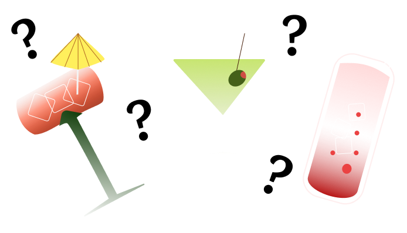

What Drink Should I Order ??

## Table of Contents
- [Introduction](#introduction)
- [Technologies](#technologies)
- [Set Up](#set-up)
- [Planning](#planning)
- [Deployment Link](#deployment-link)
- [Features](#features)
- [Contributors](#contributors)
- [Project Specifications](#project-specifications)

### Introduction

**What Drink Should I Order?** An app to help you pick a drink at the bar? For myself and my fellow indecisive humans.

### Technologies
- JavaScript
- React
- Cypress
- NextJs
- HTML
- SCSS

### Set Up
1. Clone this [repository](https://github.com/BlueNealis/what-should-I-order).
2. `cd` into the directory.
3. Run `npm i install`.
4. Run `npm run dev`.

### Planning

Excalidraw Wireframe

Figma Mock Ups

### Features
- User can get random cocktails from the Cocktail Database
- User can click home and it will direct them to the home screen

### Contributors
- [Blue Nealis](https://github.com/BlueNealis/)[LinkedIn](https://www.linkedin.com/in/blue-nealis/)
